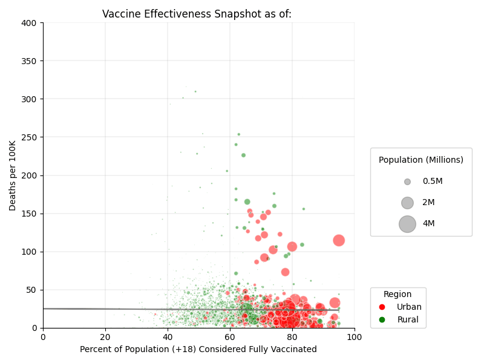

# Exploring COVID-19 Vaccine Effectiveness and predicting the number of confirmed cases based on LSTM model.

This fictional example is based on reality.

## Predecessor

This repository provides a fictional example of a project proposal for DS5110, Summer 2022.
It's based on the [vaccines project](https://github.com/ds5010/vaccines) completed by Portland students in 
the Spring 2022 version of DS 5010.
Their project was eventually put in a publicly accessible repository and included a 
github-pages (gh-pages) site: [ds5010.github.io/vaccines](https://ds5010.github.io/vaccines/).
You can use this repo as guidance for creating your own project proposal.
Additional guidance is in the [course repo](https://github.com/ds5110/summer-2022/blob/main/projects/guidance.md).

## Project partners

* Qinglin Gou (Project Leader)
* Yiqian Deng

## Goal

This project is based on the “Vaccines" project in DS5010 which investigate the effectiveness of COVID-19 vaccines at a county level. 
The goal of our project is to explore the difference between urban and rural areas in terms of vaccination rate, confirmed rate and death rate. We will also analyze the COVID-19 vaccine effectiveness between different areas based on death rate and other possible factors. We aim to investigate the relationship between population density, vaccination rate and death rate. This may provide statistical significance for the follow-up epidemiological study.


## Data

Primary sources of data will be CDC ,Johns Hopkins university and Census.gov.

* [CDC](https://data.cdc.gov/Vaccinations/COVID-19-Vaccinations-in-the-United-States-County/8xkx-amqh)
* [Johns Hopkins](https://github.com/CSSEGISandData/COVID-19)
* [Census land](https://www.census.gov/library/publications/2011/compendia/usa-counties-2011.html)
* [Census API](https://www.census.gov/data/developers/data-sets/decennial-census.html)
* [Census API user guide](https://www.census.gov/data/developers/guidance/api-user-guide.Example_API_Queries.html)


## Stakeholder

This could be a faculty member or someone from an organization with an interest in this problem who
would be willing to provide feedback on your prototypes.
* [Population Density by county:2010](https://www.census.gov/library/visualizations/2010/geo/population-density-county-2010.html)
* [Urbanized Areas and Urban Clusters: 2010](https://www.census.gov/library/visualizations/2010/geo/ua2010_uas_and_ucs_map.html)


## Preliminary result

### Pandemic Overview.

According to the 2020 census population by county [API:Population by county:2020](https://api.census.gov/data/2020/dec/pl?get=NAME,P1_001N&for=county) and the 2010 land area statistics of the United States, we calculated the population density by county. Since CDC's vaccine information is based on the county, we refer to the results of the 2020 US population density census and divide urban and rural areas by population density greater than 500 per square mile. 

1.The figure shows the population density for each county in the U.S as of 2022-6-29. 


Recreate this figure with the following command:

```
make pop
```

2.The figure shows the fully vacciened rate for each county in the U.S as of 2022-6-29. 


```
make vac
```


3.The figure shows the US deaths people Percentage ‱ for each county in the U.S as of 2022-6-29. 


Recreate this figure with the following command:

```
make deaths
```

4.The figure shows the confirmed case Percentage ‱ for each county in the U.S as of 2022-6-29. 


```
make confirmed
```

5.The figure shows the deaths-confirmed rate for each county in the U.S as of 2022-6-29. 


```
make rate
```

### Ralationship between Number of deaths and fully vaccinated rate.

Data timeline:  "01-31-2022, 02-28-2022, 03-31-2022, 04-30-2022, 05-31-2022, 06-29-2022, 07-27-2022"


Urban area (population density > 500 people per squre mile )



```
make scatter
```

### Urban VS Rural


This barchart shows the average Deaths number in each month between Urban area and Rural area.


This barchart shows the average fully vaccinated rate between Urban area and Rural area.

```
make barchat
```


## Conclution

As shown in the previous project, the overall number of deaths increased month by month. The fully vaccination rate increased slightly. From the scatter plot, we can clearly see that the complete vaccination rate in urban areas is higher than that in rural areas (The red bubble represents urban areas with relatively high population density, and the green bubble represents rural areas).

As the slope of the best-fit line increase over time. It becomes apparent that the number of deaths in urban areas is significantly lower than in rural areas. Although there are differences between rural and urban areas in terms of health insurance, public health facilities, etc., this proves to some extent the effectiveness of the vaccine. For pandemic, areas with high population density, on the contrary, have lower death rates because of higher rates of fully vaccination.

The difference between urban and rural areas in terms of the average number of deaths and the average complete vaccination rate can be clearly observed in the bar chart. The average vaccination rate has slightly increased but has stabilized over the past six months.


## Prediction

* [RNN & LSTM](https://www.youtube.com/watch?v=Mdp5pAKNNW4)

1.The figure shows the moving average of three countries daily confirmed case.


The figure shows the prediction of US daily confirmed case .


```
make lstmus
```


2.The figure shows the whole number of confirmed cases in three counties of Boston.


The figure shows the prediction of the whole confirmed cases number in suffolk county, MA.


```
make lstmcounty
```


## Project plan

[plan.md](plan.md)
